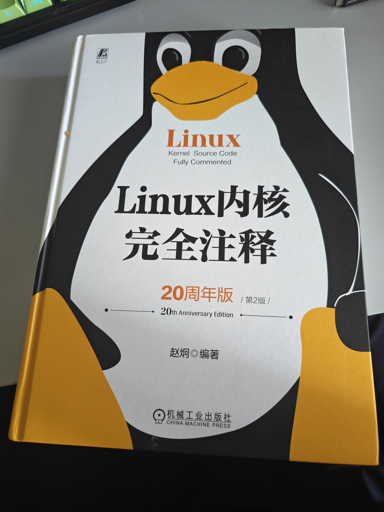
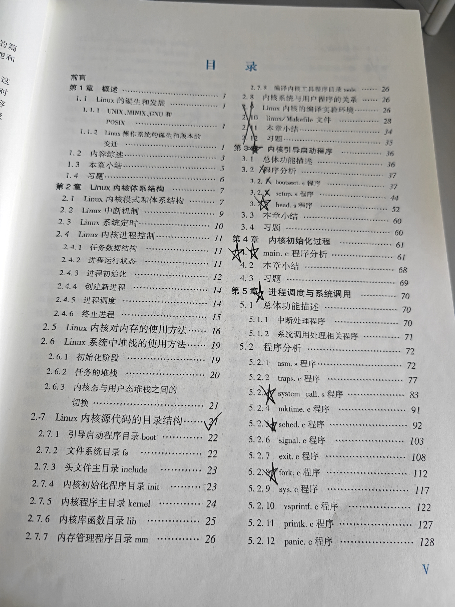
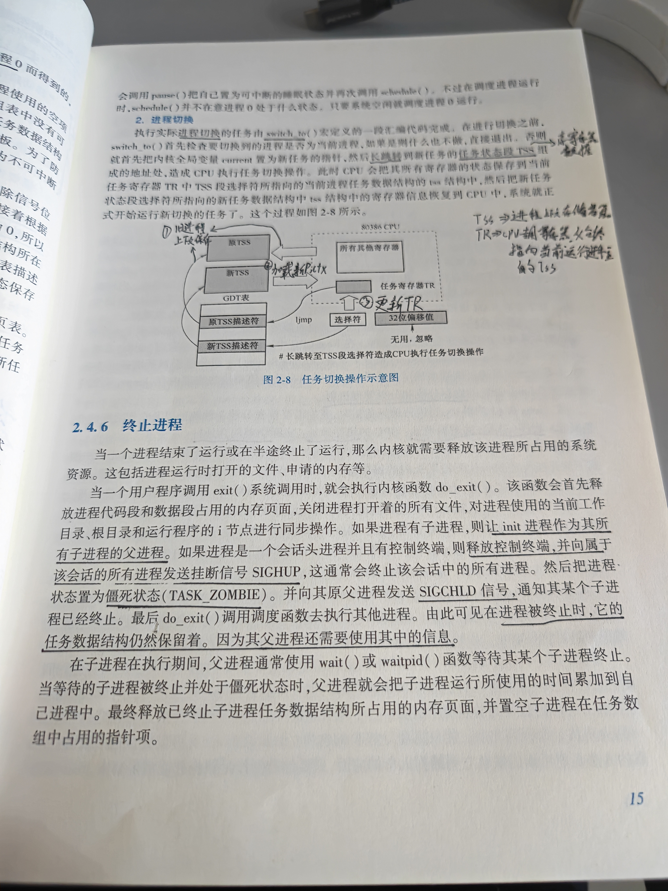
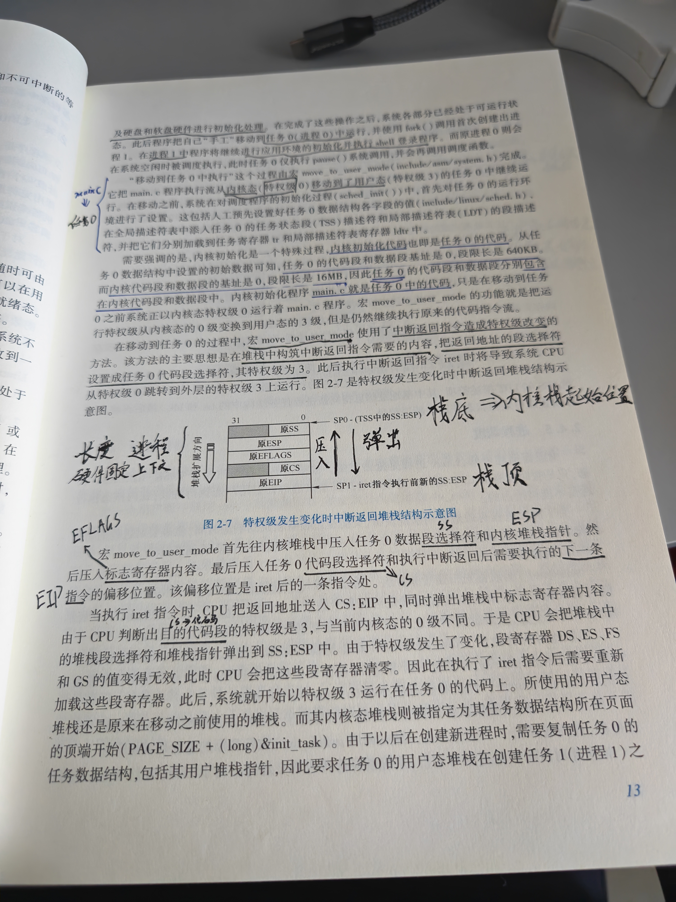

我的主要经验在云原生开发运维，熟悉 Java、Go、Rust，也经常写脚本、排查系统问题。但开始这次学习时，对汇编、GDB 和 CPU 指令基本是空白。分布式技术已经接触了不少，我希望再往内核这一侧深入，理解上层软件依赖的运行机制。

有了 AI 的辅助，这个原本门槛很高的方向变得可以尝试。不过，学习并不是从一开始就顺利的。这篇先不展开技术细节，主要记录四次学习方式的调整：读书、选择性阅读、仿写内核，以及逐步完善仿写的方法。

## 第一阶段：纯看书，用 AI 帮助理解

最初选择赵炯老师的《Linux 内核完全注释》，是因为 Linux 0.11 的源码规模相对小，适合认识内核的基本组成。这个阶段大约持续了一到两个月，主要按书的顺序阅读；遇到不懂的内容，就用豆包拍照，让 AI 解读，再围绕解释反复追问。



这段时间补了很多基础概念，也让我能够继续读下去。但回顾时发现，主要收获还是理论知识：看懂书上的解释，并不意味着知道怎样动手实现，需要调整学习方式。

## 第二阶段：结合 AI，有选择地阅读

接下来，我结合书的目录与 AI（当时主要使用 Claude Code，后续转向 Codex）讨论学习范围，不再要求每一章、每一节都按顺序读完，而是先分清哪些内容值得深入，哪些可以暂缓。



当时暂缓的内容包括旧内核的引导过程、构建编译过程，以及块设备、字符设备等章节。前两类与今天的开发环境差异较大；设备部分则先放到后面。

保留的学习主线，是内核初始化、中断与异常、内存管理、进程调度与上下文切换、系统调用，以及文件系统的基本组织。重点开始从“读完整本书”转向“理解一个内核由哪些机制组成”。

有选择地阅读后，范围更清楚了。但又坚持了几周，仍然感觉理论输入多、实践少，进度也比较慢。第一阶段解决了能不能读懂的问题，第二阶段解决了先读什么的问题，还缺少一个能把知识真正用起来的任务。

## 第三阶段：用 Rust 仿写内核，转向实践

这是整个过程中最重要的一次转折。我决定参考 Linux 0.11 的基本组成，用 Rust 编写一个简单内核，取名 aa，中文叫“一一”。Rust 是我学习了很久、也很喜欢的语言，只是在实际生产中一直没有太多使用机会；这个项目也能让我进一步练习 Rust。

前两个阶段留下的基础和笔记，这时开始有了用途。以前读进程切换、栈和特权级时，是逐个理解概念；现在有了自己的项目，就会带着“接下来要实现什么”的问题回到书里。

 

刚开始，汇编、GRUB、内核启动环境都超出了我的经验范围，所以主要由 AI 编码并帮助测试。我做的事情是逐行看代码，理解为什么要这样写：这一段解决了什么问题？依赖哪些前提？如果省略它，会发生什么？不懂的地方再回到书、源码和 AI 的解释中补齐。

有了实践对象，知识之间的联系也更容易建立。比如“启动需要一个栈”，以前只是书上的一句话；现在要在自己的项目中找到预留栈空间的位置、设置栈指针的代码，并观察它是否真的生效。学习不再停在概念解释上，而是围绕一个具体问题，把理解、实现和验证连起来。

这个阶段并不快。到现在，aa 还没有真正进入 Rust 内核主函数，启动前要补的知识比预想的多。不过，通过旧内核源码阅读和 aa 的启动实验，前面零散的知识已经串联起来，收获还是很多。

对我来说，转折不是代码写得更多了，而是学习有了一个持续推进的对象。读书、问 AI、看源码，都开始服务于眼前的小任务；完成一个能运行、能观察的步骤，再继续下一个。

## 第四阶段：完善仿写方法，加入现代源码对照

仿写过程中又遇到了新的问题：Linux 0.11 的启动方式与 aa 面向的现代环境差异很大。准备自己编写启动检查、GDT、页表等功能时，仅仅觉得 AI 给出的代码逻辑上说得通还不够，我希望有真实源码作为参照。

因此，我把 Linux 6.18 也引入了学习项目：用 Linux 0.11 认识内核的基本组成和机制，用现代 Linux 对照实现条件的变化，再在 aa 中完成一个尽量小的实现。不是同时通读两套源码，而是围绕当前问题，查找各自对应的部分。

目前项目中的主要目录如下。自己的实现、新旧源码和学习记录放在一起，方便在同一个问题下切换查看；这里只列学习相关的部分。

```text
_aa_kernel/
├── aa/                            # 自己编写的 Rust 内核
│   ├── .cargo/config.toml         # 裸机目标与链接配置
│   ├── Cargo.toml
│   ├── build.rs
│   ├── Makefile                   # 构建、启动与调试入口
│   ├── boot/
│   │   ├── entry.S                # 汇编启动代码
│   │   └── linker.ld              # 内核内存布局
│   ├── debug/entry.gdb            # GDB 检查脚本
│   ├── grub/grub.cfg
│   └── src/main.rs                # 尚未实际进入的 Rust 入口
├── linux-0.11-note-songwz/         # 旧内核：基础组成与机制
│   ├── boot/
│   ├── kernel/
│   ├── mm/
│   └── fs/
├── new-linux-6.18/                # 现代内核：实现差异对照
│   ├── arch/x86/
│   ├── init/main.c
│   └── _aa_reference/             # 独立的现代内核实验
└── _docs/
    ├── Study-Roadmap.md           # 学习路线与验收标准
    ├── AA-Study-Progress.md       # 当前检查点与下一步
    ├── AA-Assembly-and-GDB.md     # 汇编和调试笔记
    └── Linux-Modern-Reference.md  # 现代源码对照基线
```

AI 的角色也在调整。最初主要由它搭建和测试，我阅读理解；现在开始把小步骤的实现与调试接回来，让 AI 帮助解释背景、定位参照和检查思路。每次先明确要解决的问题，再查源码、写代码、用实验验证，最后记录结果，给下一次学习留下明确的继续位置。

这也让我重新理解第二阶段的取舍：暂缓旧版本的某种实现，并不等于绕过它背后的知识。需要实现的机制，仍要在合适的时机补回来，只是用当前项目需要的方式学习。

## 目前的进度与后续计划

目前已经梳理过 Linux 0.11 的启动链路，也搭好了 aa 的基础工程：裸机 Rust 构建、内核内存布局、GRUB/Multiboot2 加载，以及 QEMU/GDB 调试。32 位入口中的参数保存和启动栈已有动态验证；我也已经亲自连接 GDB，命中汇编入口断点。

启动 magic 的比较代码已经写入，接下来先完成正常、错误分支的验证，再准备 64 位运行环境，真正进入 Rust 内核主函数。之后补上串口与 panic 输出，让实验结果更容易观察。



图中箭头表示学习推进顺序，虚线部分是尚未实现的后续计划。这里只列涉及的技术，具体实现留到后面的系列文章。

等进度走到开始编写 Rust 内核主函数时，我准备更新这个系列的下一篇，集中回顾此前完成的启动与调试内容。之后再随着实践推进，逐步展开异常、内存、调度、用户态和文件系统等专题。

这几次调整给我最大的启发，是让学习围绕一个可以推进、可以验证的小项目展开。书提供基础，源码提供参照，AI 帮助跨过陌生知识的门槛，自己的实现和实验则帮助判断是否真正理解。对于同样有开发运维经验、但缺少底层基础的人，这条路径也许值得参考。
