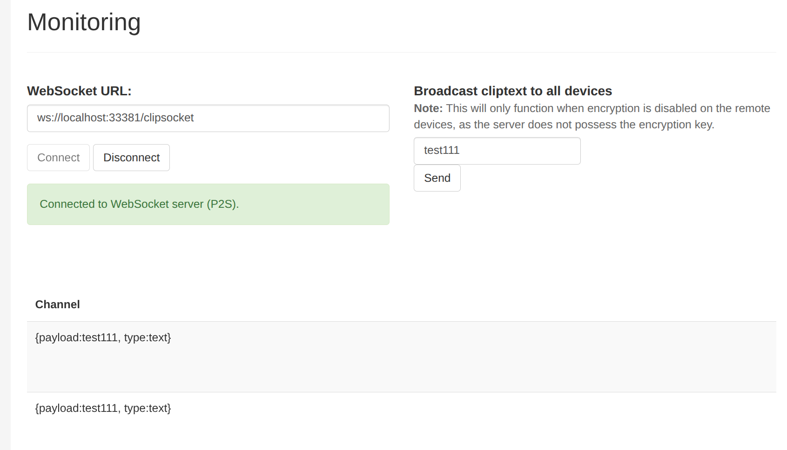

# “win”和“linux-wayland”通过deskflow共享键鼠，解决剪切板不能共享的问题

## 先说背景，不想听故事可跳过😀

之前装的E5主机一直将linux作为工作主力机，开发体验非常好；但是公司这边需要各种会议、办公和安全的软件，在linux上就有很多兼任性问题，靠win虚拟机、wine等各种方案适配了很多，后来又装了一台9950X的台式机，系统是windows，开发和办公也都用回windows，之前E5的linux主机就当服务器用了；

这几天比较心痒，想换回linux开发（就相当于把显示器鼠标从windows的台式机再插回E5主机），然后保留windows主机跑一些需要win的办公软件，一共三台显示器，两台开发用的插在linux上，一台办公用的显示器插在windows上；

然后就是搞键鼠和剪切板共享，一套键鼠操作多台主机。如果linux是x11的，那这一步非常简单，之前一直用的[deskflow](https://github.com/deskflow/deskflow)，两台主机装好服务，通过局域网连接上基本就搞定了；

**而这次想尝试下wayland遇到一个问题，键鼠可以共享，剪切板不能共享了**

然后先到github的issues上查了下，果然有人提了相关问题，[官方给出的恢复](https://)：这就是wayland的已知BUG，需要依赖上游解决；问题到这好像是只能等了，但这个官方回复下面有个人说了一嘴可以用kde-connect来共享剪切板，这不正好我用的kubuntu，然后我兴致勃勃给两台主机装上各自OS版本的kde-connect后，发现这玩意虽然可以快速找到局域网内的主机，但是过几秒就会断连，甚至连上就秒断，这个方案也不行；但是这个过程给我打开了新思路，于是我google必应查半天，最终锁定了[ClipCascade](https://github.com/Sathvik-Rao/ClipCascade)

## ClipCascade安装

ClipCascade需要部署一个server记录剪切板内容，然后所有的client通过websocket连接到server来同步剪切板内容

server是一个jar包，可以docker启动，也可以直接java -jar启动

client支持的设备看下面的表（来自官方README）


| Type      | Windows | MacOS | Linux GUI | Linux CLI | Android |
| --------- | ------- | ----- | --------- | --------- | ------- |
| **Text**  | ✔      | ✔    | ✔        | ✔        | ✔      |
| **Image** | ✔      | ✔    | ✔        | ✔        | ✔      |
| **Files** | ✔      | ✔    | ✔        | ✔        | ✔      |

### server部署

```bash
docker run \
-d \
--name clipcascade \
-p 33381:8080 \
-e CC_MAX_MESSAGE_SIZE_IN_MiB=100 \
-v /root/p/linux-app/data/cc_users:/database \
sathvikrao/clipcascade
```

#### 支持的ENV可以看[官方配置文档](https://github.com/Sathvik-Rao/ClipCascade?tab=readme-ov-file#environment-variables)

部署好后可以打开http://localhost:33381/

默认管理员凭据：

* **用户名：** `admin`
* **密码：** `admin123`



点击`connect`表示作为client连接到server，然后可以在右侧输入框输入文本，send就会同步到所有client，在下面channel可以看到刚才send的内容，每次有两条猜测分别是发送和接受的

### windows、linux客户端

#### 根据操作系统和架构到[官方release](https://github.com/Sathvik-Rao/ClipCascade/releases)下载对应包

##### windows就是一个单一exe文件，依赖都在里面，双击直接启动，然后输入server的地址，用户名密码就可以

##### linux下载好解压开需要通过main.py脚本启动，官方没有打包，需要手动安装各种依赖，这里重点讲一下[官方依赖安装流程](https://github.com/Sathvik-Rao/ClipCascade?tab=readme-ov-file#%EF%B8%8F-linux-desktop-application-gui--%EF%B8%8F-linux-terminal-based-application-cli)以外的处理

```bash
# gi安装包处理
sudo apt update &&  apt install -y python3-gi
# 如果是自己虚拟的python环境，比如我用的conda，gi这个包直接pip3 install gi找不到，需要再手动处理下
# ubuntu
ln -s /usr/lib/python3/dist-packages/gi  <my-python-path>/site-packages/gi
# fedora
ln -s /usr/lib/python3/site-packages/gi  <my-python-path>/site-packages/gi

# 卸载旧的websocket包，重新安装
pip3 uninstall websocket websockets websocket-client
pip3 install websocket-client

```

#### 可以在各个客户段随便复制点内容，然后在server的web页面上可以看到channel有同步到数据
