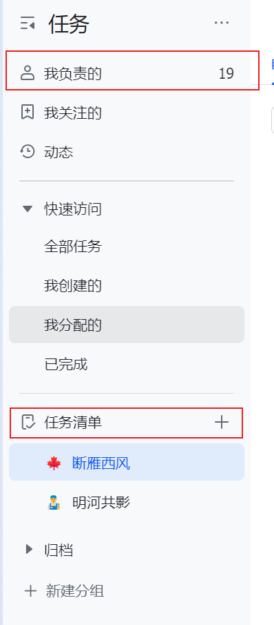
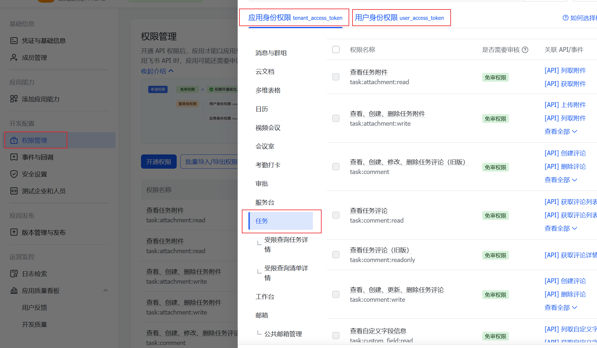
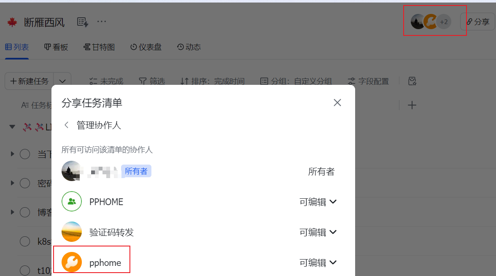

## 背景

目前在用飞书的任务功能来记录一些代办，安排生活、工作上的一些计划；
之前是这个`我负责的`里面来添加任务，后来在下面建了一个任务清单，然后在清单内维护代办事项


然后问题就来了：
- 在`我负责的`创建的任务，默认我就是负责人，在日历中是直接可以看到的，而任务清单需要每次都要手动添加负责人；
- 而任务清单可以将一个清单内的任务直接作为页面分享，而在`我负责的`创建的任务默认没有任务清单
后面准备调整一下生活工作的节奏，记录下每天的运动打卡任务，如果在日历里直接可以看到那还是很有成就感的，于是就看了下飞书的SDK，准备手写脚本给任务清单批量加一下负责人；本来以为很简单，但最终还是花了几个小时，在这里把过程和遇到的问题记录一下，分享给大家；

## 前置条件

需要一个飞书账号，我是用的飞书企业账号，没有企业认证，实际里面就我和我对象俩人

## 应用与权限配置

1. [创建应用](https://open.feishu.cn/app)
2. 给应用开通接口权限，应用权限和用户权限都加上
   没有这一步调接口会返回unauthorized
   3. [查看任务清单列表](https://open.feishu.cn/document/task-v2/tasklist/list )	找到要处理的任务清单id；这个时候应用还没权限，可以先用user_access_token；
   **简要说明下用户token和租户token：**
   - 用户token：需要走飞书登录流程，登录成功后获取的token
   - 租户token：可以简单理解为应用的ak、sk，无需每次登录
3. [添加清单成员](https://open.feishu.cn/document/task-v2/tasklist/add_members )
   这一步类似于加数据权限，不然每次用租户token查询的数据都是空
   页面貌似只能加人，不能加应用，接口是可以把应用加到清单的协作人里
   我卡了很久，最后问了下平台的AI才找到原因；
   加成功在任务清单可以看到应用
   
## 批量处理脚本

[源码仓库](https://gitcode.com/2501_90571811/blog_note/tree/main/feishu-gosdk)

- 先装一下sdk
  - go get -u github.com/larksuite/oapi-sdk-go/v3@latest
- main.go代码：

```go
package main

import (
	"context"
	"fmt"
	"github.com/larksuite/oapi-sdk-go/v3"
	"github.com/larksuite/oapi-sdk-go/v3/core"
	"github.com/larksuite/oapi-sdk-go/v3/service/task/v2"
	"time"
)

// 用户id，第三步查任务清单的时候，看清单的members可以直接看到
const uId = `xxx`

// 创建好应用，应用的首页默认就是基础信息与凭证
const appId = `xxx`
const appSecret = `xxx`

// 清单id，第三步的时候看name找id
const tasklistGuid = `xxx`

// 创建 Client
var client = lark.NewClient(appId, appSecret)
var sum = 0
var reqCount = 0

func main() {

	tasksTasklistReq := larktask.NewTasksTasklistReqBuilder().
		TasklistGuid(tasklistGuid).
		PageSize(100).
		UserIdType(`open_id`)
	pageToken := ""
	for {
		if pageToken != "" {
			tasksTasklistReq.PageToken(pageToken)
		}

		// 获取清单下的任务
		resp, err := client.Task.V2.Tasklist.Tasks(
			context.Background(),
			tasksTasklistReq.Build())
		// 处理错误
		if err != nil {
			fmt.Println(err)
			return
		}

		// 服务端错误处理
		if !resp.Success() {
			fmt.Printf("logId: %s, error response: \n%s", resp.RequestId(), larkcore.Prettify(resp.CodeError))
			return
		}
		// 循环处理任务
		for _, task := range resp.Data.Items {
			sum++
			proc(task)
		}
		if !*(resp.Data.HasMore) {
			fmt.Println("no more task")
			break
		}
		pageToken = *resp.Data.PageToken
	}
	fmt.Printf("任务总数：%d，处理：%d ", sum, reqCount)
}

func proc(task *larktask.TaskSummary) {
	for _, m := range task.Members {
		if *m.Id == uId && *m.Role == "assignee" {
			fmt.Printf("%s,already in task\n", *task.Guid)
			return
		}
	}
	// 接口频率限制 100次/一分钟，可以根据网速自己缩小一下时间
	if reqCount >= 99 && reqCount%99 == 0 {
		fmt.Println("sleep 10s")
		time.Sleep(60 * time.Second)
	}
	//  给任务添加 成员
	resp, err := client.Task.V2.Task.AddMembers(context.Background(), larktask.NewAddMembersTaskReqBuilder().
		TaskGuid(*task.Guid).
		UserIdType(`open_id`).
		Body(larktask.NewAddMembersTaskReqBodyBuilder().
			Members([]*larktask.Member{
				larktask.NewMemberBuilder().
					Id(uId).
					Type(`user`).
					Role(`assignee`).
					Build(),
			}).
			Build()).
		Build())
	reqCount++
	// 处理错误
	if err != nil {
		fmt.Println(err)
		return
	}

	// 服务端错误处理
	if !resp.Success() {
		fmt.Printf("logId: %s, error response: \n%s", resp.RequestId(), larkcore.Prettify(resp.CodeError))
		return
	}

	// 业务处理
	fmt.Println(larkcore.Prettify(resp))
}


```
