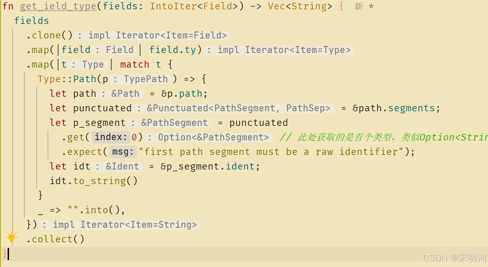

## 搜了下中文社区的资料,没找到相关的内容，自己探索了几次找到了方法，贴出来大家参考

## 直接贴代码

```rust
use proc_macro2::Ident;
use quote::{format_ident, quote, quote_spanned};
use syn::punctuated::{IntoIter, Punctuated};
use syn::token::Comma;
use syn::{Data, DataStruct, Expr, Field, Fields, LitStr, Meta, Type};
fn get_ield_type(fields: IntoIter<Field>) -> Vec<String> {
  fields
    .clone()
    .map(|field| field.ty)
    .map(|t| match t {
      Type::Path(p) => {
        let path = &p.path;
        let punctuated = &path.segments;
        let p_segment = punctuated
          .get(0) // 此处获取的是首个类型，类似Option<String>，0 是Option，1是String
          .expect("first path segment must be a raw identifier");
        let idt = &p_segment.ident; // 实际是一个ident
        idt.to_string()
      }
      _ => "".into(), // 其他类型，Type本身是个枚举，类型很多我基本一个没看懂，也没找到比较好的资料，如果大家有的话分享一下
    })
    .collect()
}
```

### 这个mod里还有其他逻辑，use引入明显有冗余，这个我就不做处理了，可以不用我这个use，create引入过程宏三件套直接来自己引入

### 我这里是derive宏标记了下面这个结构体

```
pub struct Model {
  pub name: Option<String>,
  pub id: Uuid,
  pub created_date: DateTime,
  pub created_by: String,
  pub updated_date: DateTime,
  pub updated_by: String,
  pub is_delete: i32,
}
```

### 函数返回会得到类似这样的vec:

```
["Option", "Uuid", "DateTime", "String", "DateTime", "String", "i32"]
```

## 补充一个过程宏调试的方法

### 之前调试的时候基本只是看编译报错，但是这次找类型就想找一个能断电DEBUG或者打印信息的方式，最终尝试了两个方式可以

1. 直接  println!() 宏，这个方式可以在编译的时候打印内容到控制台
2. 另一种是直接 panic!()，这个方式明显也可以

### 目前我是打印或者panic，然后写一个test标记的fn，然后cargo  test 对应的方法

### 应该还有更优雅，甚至可以直接DEBUG的方法，期待大佬们的分享，我也相当于抛砖引玉了

## 再补充一个Option<String>对应println! 出来syn::Path的类型格式给大家参考

### 我手动缩进了一下，两个::的前后表示枚举及对应类型

```
syn::Path {
    leading_colon: None,
    segments: [
        PathSegment {
            ident: Ident {
                ident: "Option",
                span: #0 bytes(763..769)
            },
            arguments: PathArguments::AngleBracketed {
                colon2_token: None,
                lt_token: Lt,
                args: [
                    GenericArgument::Type(Type::Path {
                        qself: None,
                        path: Path {
                            leading_colon: None,
                            segments: [
                                PathSegment {
                                    ident: Ident {
                                            ident: "String",
                                            span: #0 bytes(770..776)
                                    },
                                    arguments: PathArguments::None
                                }
                            ]
                        }
                    })
                ],
                gt_token: Gt
            }
        }
    ]
}
```

### 这个是clion中的代码截图，IDE中可以直接看到field中每解析一步，对应的类型



### Field ==> Type::Path(TypePath) ==> Path ==> Punctuated<PathSegment, PathSep> ==> PathSegment ==> ident

### 其中 Punctuated本质是一个vec

```rust
pub struct Punctuated<T, P> {
    inner: Vec<(T, P)>,
    last: Option<Box<T>>,
}
```

### PathSegment除了ident作为当前的类型名以外，还有一个arguments字段，类型是PathArguments枚举，

```rust
#[cfg_attr(docsrs, doc(cfg(any(feature = "full", feature = "derive"))))]
pub enum PathArguments {
    None,
    /// The `<'a, T>` in `std::slice::iter<'a, T>`.
    AngleBracketed(AngleBracketedGenericArguments),
    /// The `(A, B) -> C` in `Fn(A, B) -> C`.
    Parenthesized(ParenthesizedGenericArguments),
}
#[cfg_attr(docsrs, doc(cfg(any(feature = "full", feature = "derive"))))]
pub struct AngleBracketedGenericArguments {
     pub colon2_token: Option<Token![::]>,
     pub lt_token: Token![<],
     pub args: Punctuated<GenericArgument, Token![,]>,
     pub gt_token: Token![>],
 }
#[cfg_attr(docsrs, doc(cfg(any(feature = "full", feature = "derive"))))]
#[non_exhaustive]
pub enum GenericArgument {
    /// A lifetime argument.
    Lifetime(Lifetime),
    /// A type argument.
    Type(Type), // ### 这里再次出现Type类型，实现了类型嵌套
    /// A const expression. Must be inside of a block.
    ///
    /// NOTE: Identity expressions are represented as Type arguments, as
    /// they are indistinguishable syntactically.
    Const(Expr),
    /// A binding (equality constraint) on an associated type: the `Item =
    /// u8` in `Iterator<Item = u8>`.
    AssocType(AssocType),
    /// An equality constraint on an associated constant: the `PANIC =
    /// false` in `Trait<PANIC = false>`.
    AssocConst(AssocConst),
    /// An associated type bound: `Iterator<Item: Display>`.
    Constraint(Constraint),
}
```

### 而AngleBracketedGenericArguments类型再进去还会出现Type类型，实现类型的嵌套

## TODO，每搞清楚为啥segments本身是一个数组，猜测是处理泛型用的，必须rust可以像python的union一样给泛型加多个特征实现，比如`T: Send + Sync`，待后续验证一下
