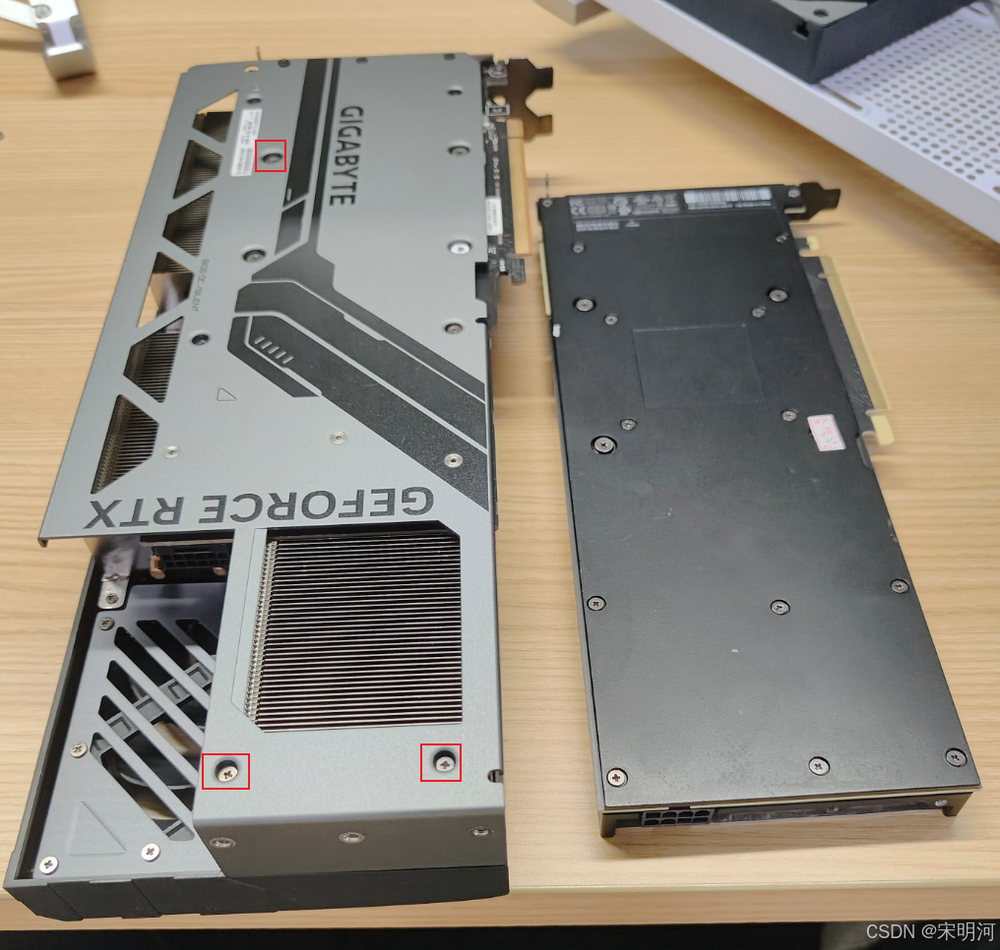
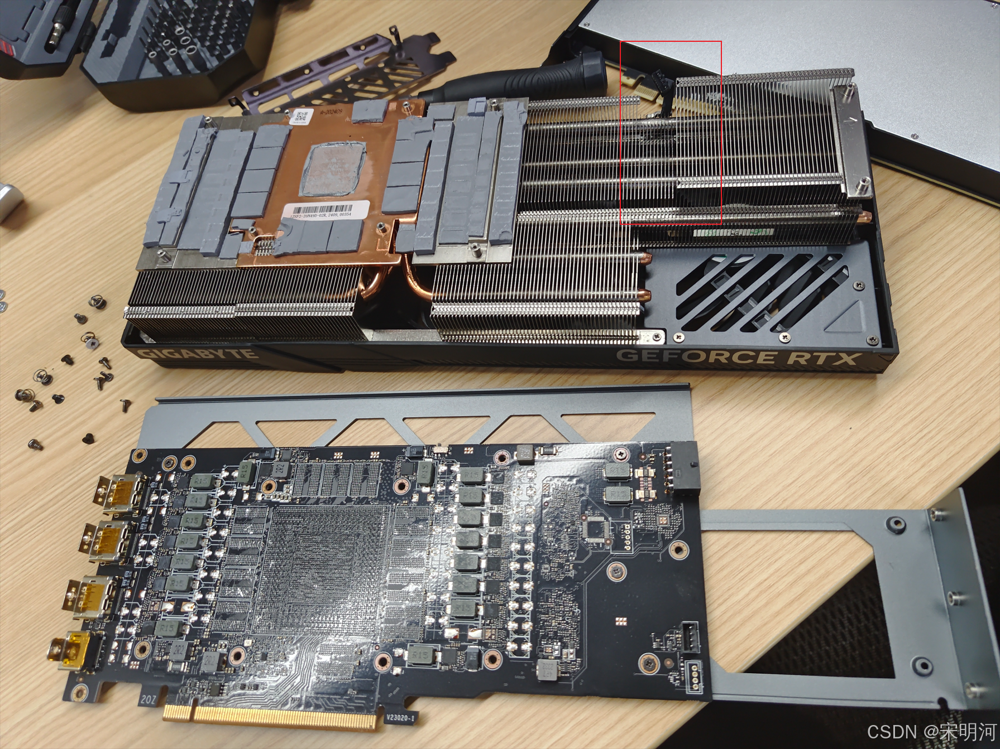
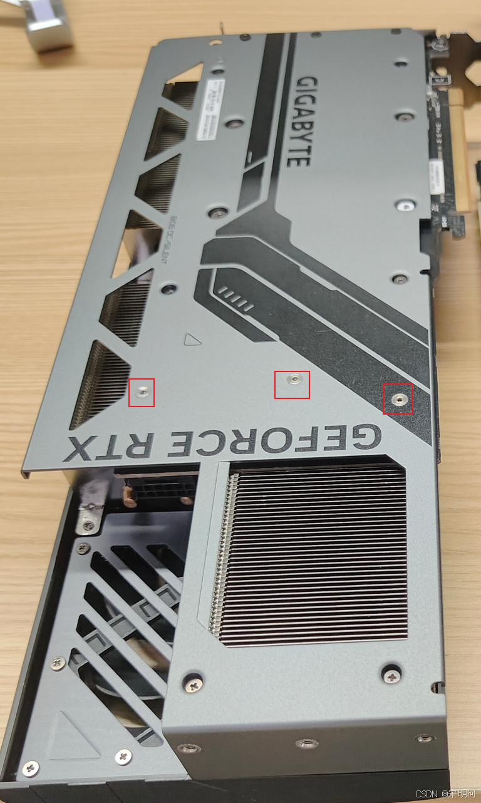
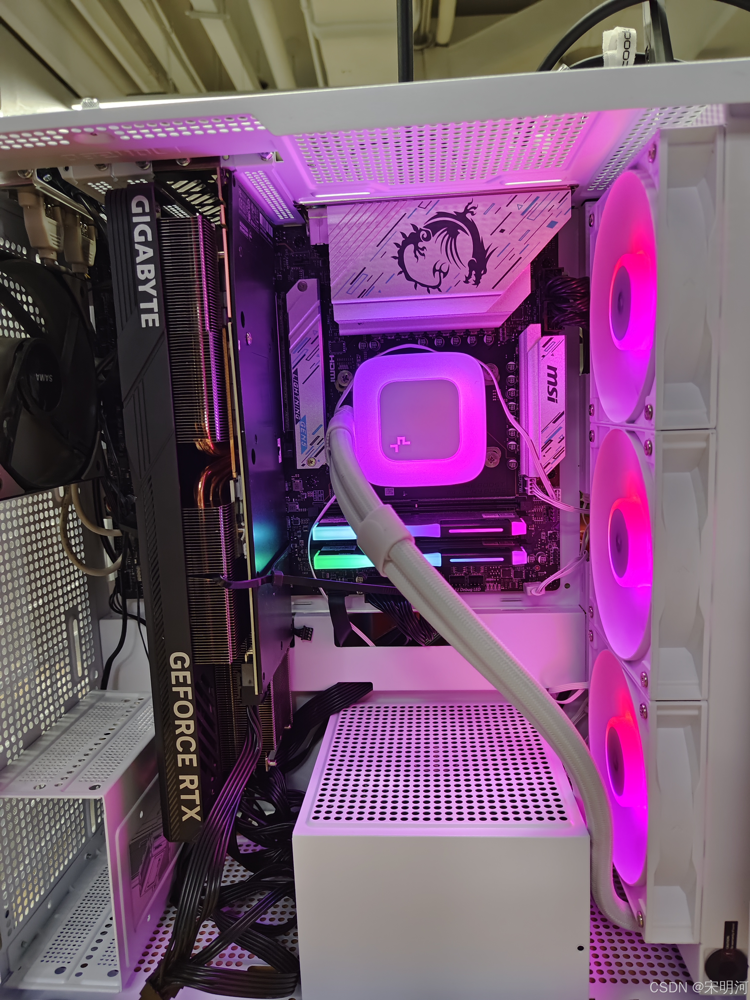

## 背景

之前搞了一张特斯拉的T10计算卡，跑跑AI模型，使用起来强度也不是很大，散热就简单在屁股上加了个涡轮扇，用硬纸壳壳密封一下；后面在拼DD闲逛的时候发现有4090被挖核心的显卡，而且恰巧技嘉4090风魔也是后接电的，跟T10很相像，就花了80大洋买了一个被掏了核心和显存的4090回来自己搞了下散热，简单记录下分享给大家参考

## 装配与背板固定

左边是买回来的4090风魔，可以看到在屁股上切了一刀用于后插电；

> 两个显卡的模型不是很匹配，背板只能上我标红的3个螺丝
> 如果核心周围4个螺丝都想加上的话需要自己在散热板上攻丝加螺柱，背板打孔；
> 核心周围我只上了1个螺丝+尾部2个，但是已经可以稳稳压住T10，就没再折腾；

## 散热片与导热处理

拆下散热的4090，注意红框处的散热片需要拆几片下来，因为T10比4090还是要长一点，这个地方会抬高一点显卡的PCB板
我一开始没拆，显卡有点弯，开机识别不到显卡，差点以为给显卡搞坏了
散热铜片上的导热片我基本没动，跟T10基本是一致的，可以直接扣上
显卡核心相对4090稍稍往下了一点，下面的白色标签也覆盖了一点，标签的胶很粘，我就犯懒没撕，想着反正一个300W的散热来压我这150W不随便搞，结果后面烤鸡的时候hotspot有85，核心温度才58，

4090显卡背板这几个螺柱要拆掉，不然会压低显卡，一样会遇到显卡不识别的问题

## 安装效果与风扇接线

装好以后差不多就是这样，当时还是用的T10的背板，4090的我拿回家拆螺柱了；
还得注意下需要买显卡风扇ph2.0母口转主板pwm公口
