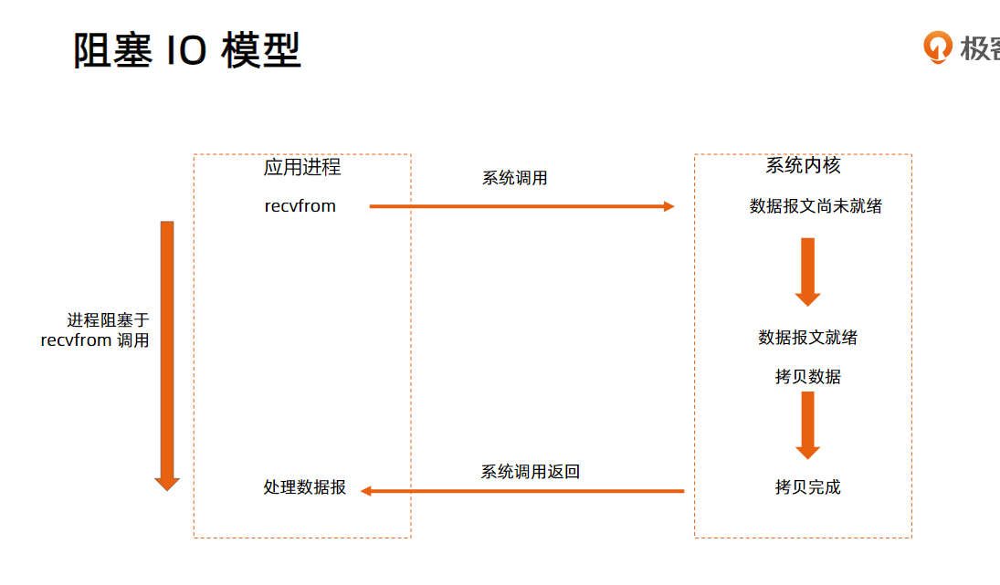
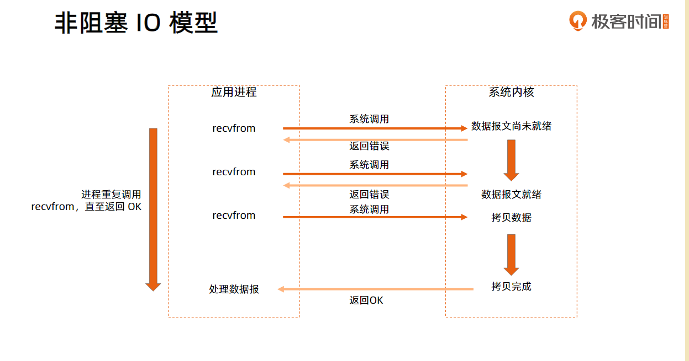
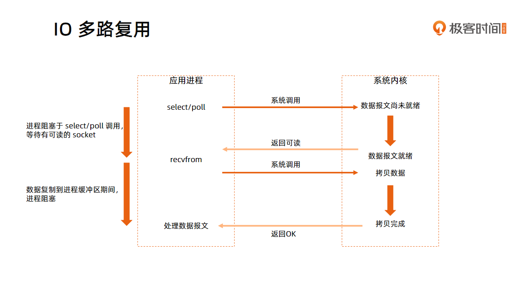
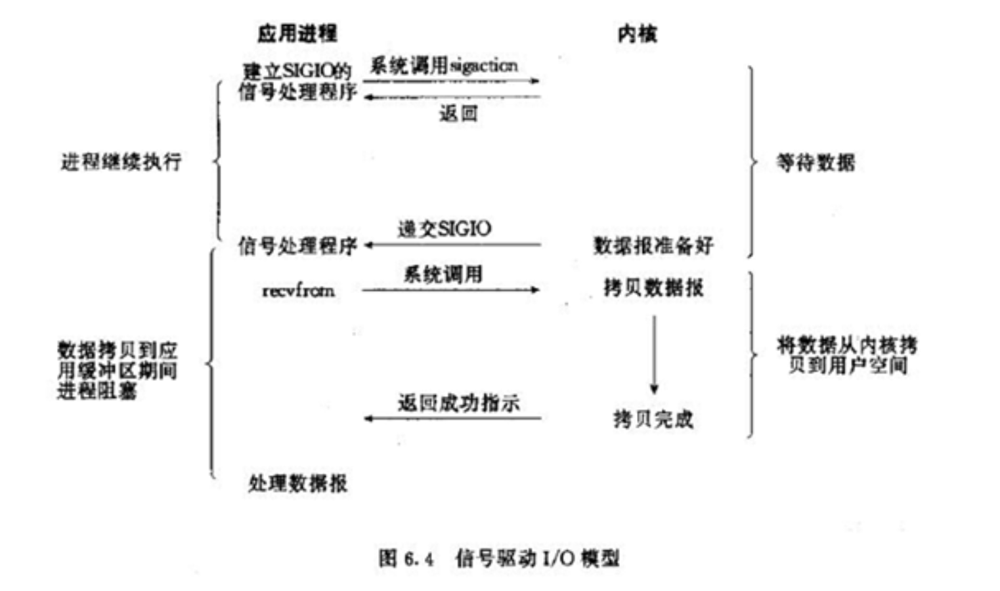
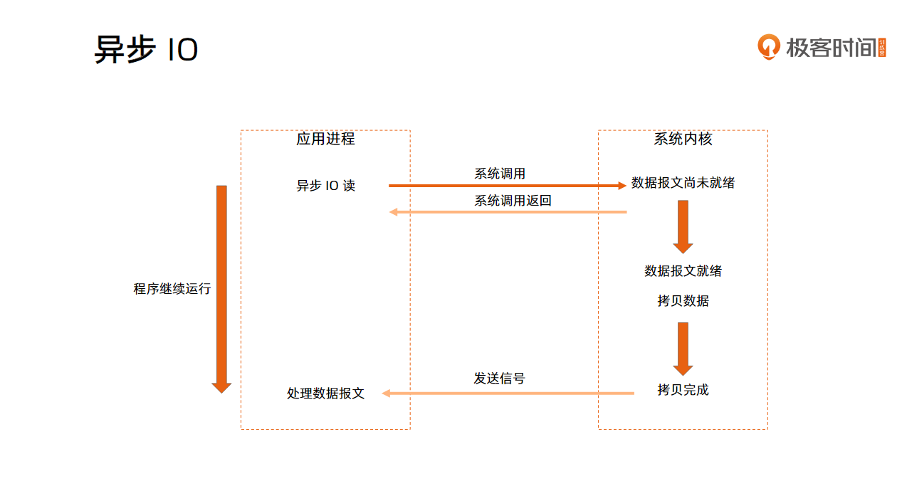
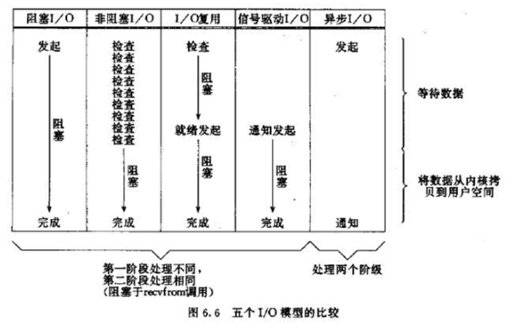
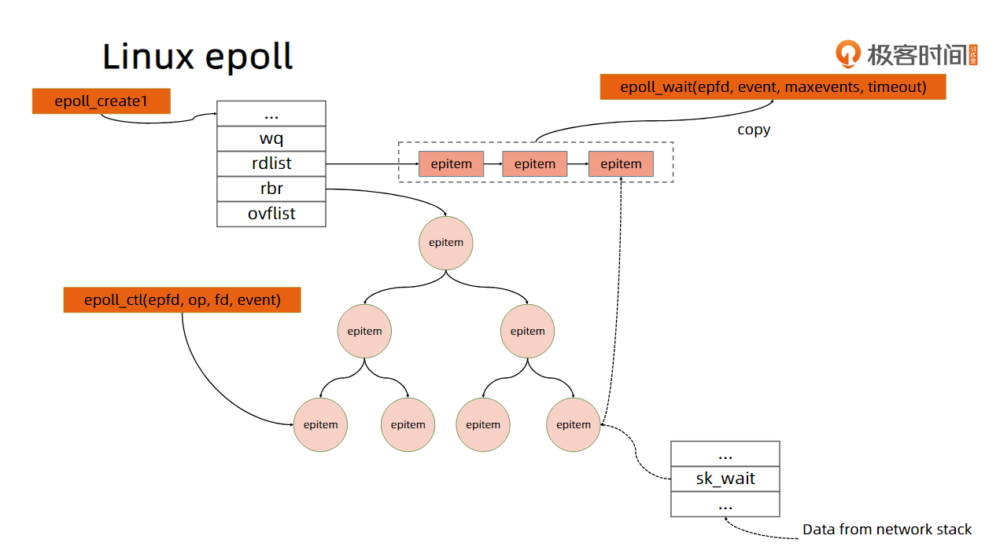
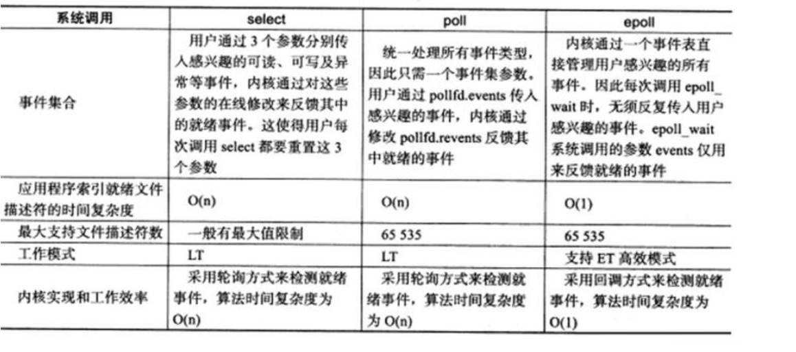
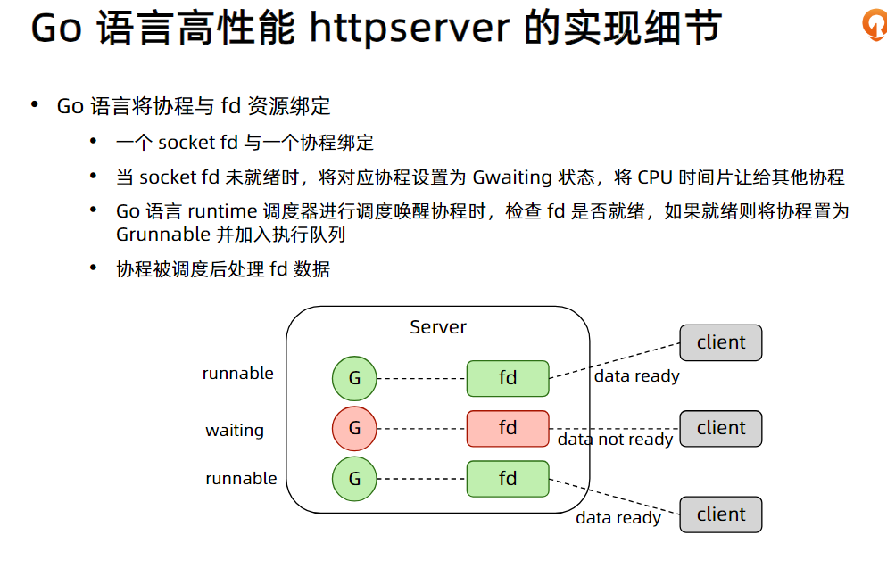

### **1. 阻塞IO模型**

进程发起IO系统调用后，进程被阻塞，转到内核空间处理，整个IO处理完毕后返回进程。操作成功则进程获取到数据。

**1、典型应用：阻塞socket、Java BIO；**

**2、特点：**

- 进程阻塞挂起不消耗CPU资源，及时响应每个操作；
- 实现难度低、开发应用较容易；
- 适用并发量小的网络应用开发；

不适用并发量大的应用：因为一个请求IO会阻塞进程，所以，得为每请求分配一个处理进程（线程）以及时响应，系统开销大。

### **2. 非阻塞IO模型**

进程发起IO系统调用后，如果内核缓冲区没有数据，需要到IO设备中读取，进程返回一个错误而不会被阻塞；进程发起IO系统调用后，如果内核缓冲区有数据，内核就会把数据返回进程。

对于上面的阻塞IO模型来说，内核数据没准备好需要进程阻塞的时候，就返回一个错误，以使得进程不被阻塞。

1、典型应用：socket是非阻塞的方式（设置为NONBLOCK）

2、特点：

- 进程轮询（重复）调用，消耗CPU的资源；
- 实现难度低、开发应用相对阻塞IO模式较难；
- 适用并发量较小、且不需要及时响应的网络应用开发；

### 3. **IO复用模型**

多个的进程的IO可以注册到一个复用器（select）上，然后用一个进程调用该select， select会监听所有注册进来的IO；

如果select没有监听的IO在内核缓冲区都没有可读数据，select调用进程会被阻塞；而当任一IO在内核缓冲区中有可数据时，select调用就会返回；

而后select调用进程可以自己或通知另外的进程（注册进程）来再次发起读取IO，读取内核中准备好的数据。

可以看到，多个进程注册IO后，只有另一个select调用进程被阻塞。

1、典型应用：select、poll、epoll三种方案，nginx都可以选择使用这三个方案;Java NIO;

2、特点：

- 专一进程解决多个进程IO的阻塞问题，性能好；Reactor模式;
- 实现、开发应用难度较大；
- 适用高并发服务应用开发：一个进程（线程）响应多个请求；

3、select、poll、epoll

- Linux中IO复用的实现方式主要有select、poll和epoll：
- Select：注册IO、阻塞扫描，监听的IO最大连接数不能多于FD_SIZE；
- Poll：原理和Select相似，没有数量限制，但IO数量大扫描线性性能下降；
- Epoll ：事件驱动不阻塞，mmap实现内核与用户空间的消息传递，数量很大，Linux2.6后内核支持；

### 4. **信号驱动IO模型**

当进程发起一个IO操作，会向内核注册一个信号处理函数，然后进程返回不阻塞；当内核数据就绪时会发送一个信号给进程，进程便在信号处理函数中调用IO读取数据。

特点：回调机制，实现、开发应用难度大；

### 5. **异步IO模型**

当进程发起一个IO操作，进程返回（不阻塞），但也不能返回果结；内核把整个IO处理完后，会通知进程结果。如果IO操作成功则进程直接获取到数据。

1、典型应用：JAVA7 AIO、高性能[服务器](https://cloud.tencent.com/act/pro/promotion-cvm?from_column=20065&from=20065)应用

2、特点：

- 不阻塞，数据一步到位；Proactor模式；
- 需要操作系统的底层支持，LINUX 2.5 版本内核首现，2.6 版本产品的内核标准特性；
- 实现、开发应用难度大；
- 非常适合高性能高并发应用；

